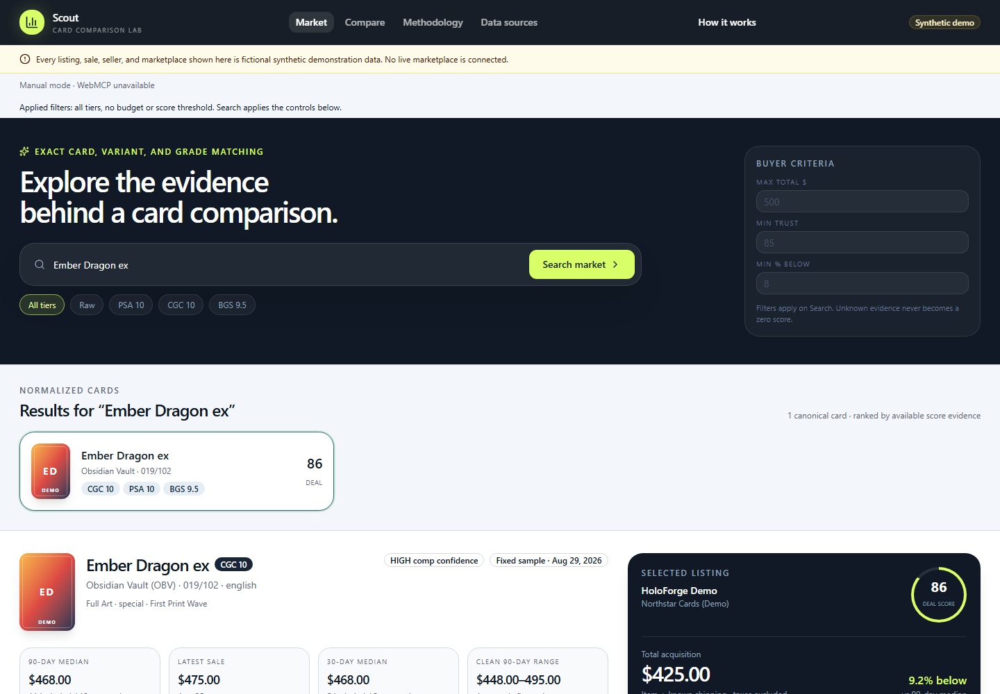

# Scout

A free, browser-based **card comparison lab** for exploring exact card identity, price comparisons, seller evidence, and transparent scoring. People and browser agents use the same calculation engine through the interface and six WebMCP tools.

**All cards, marketplaces, sellers, listings, and sales are fictional sample data. Scout does not search real marketplaces, value real cards, authenticate cards, or support purchases.** The fixed sample is dated August 29, 2026; it does not refresh with today's prices.

[Open Scout](https://scout-webmcp-2026.alx21.chatgpt.site/) · [Usage guide](docs/DEMO.md) · [Calculation methodology](docs/METHODOLOGY.md) · [Report a problem](https://github.com/agammann/scout-webmcp/issues)



## Try it

1. Open the site in a modern browser. No account or API key is needed.
2. Search `Ember Dragon ex`, `Volt Lynx`, or `Tide Oracle`. Search uses keywords, not natural-language instructions; an empty query browses the sample cards.
3. Choose a tier and optionally enter a maximum total in USD, minimum Seller Trust, or minimum percent below the median. Click **Search market**. The applied-filter summary and matching listing cards show the active result set.
4. Use **Inspect evidence** to select a listing. Open **Score breakdown and seller evidence** for component scores, weights, and explanations. The history chart retains flagged anomalies; cleaned medians exclude them.
5. Add two to five listings with **Compare**, then open the comparison. Remove a row to free a slot. Each score uses that listing's own exact market tier; different tiers are not a single price market.
6. Read the **Raw versus graded** section to see every tier for the selected card, regardless of search filters. **How it works** and **Data sources** explain the evidence and limitations.

Scout contains three fictional cards, ten deduplicated listings, and nine exact market tiers. Search and comparison selections last only for the current page session; reloading resets the workspace. There are no saved watchlists, price alerts, imports, checkout, or live-data credentials to configure.

## WebMCP

A compatible browser/agent host can discover the page's tools through `document.modelContext.registerTool`. The status line reports **6 agent tools ready**, manual mode, or a registration failure. Ordinary browsers can use every manual workflow without WebMCP. This is a page-side integration, not a remote MCP server.

| Tool                    | Task                                                                                                                                    |
| ----------------------- | --------------------------------------------------------------------------------------------------------------------------------------- |
| `search_cards`          | Keyword search with budget, raw/graded, exact company/grade, trust, and discount filters; returns matching listing IDs grouped by card. |
| `get_card_market_state` | Inspect every sample listing and exact-tier statistic for a canonical card.                                                             |
| `assess_listing`        | Inspect one listing's cost, comparable sales, score components, seller evidence, and risks.                                             |
| `compare_listings`      | Compare 2–5 unique listing IDs; no winner is selected when every overall score is withheld.                                             |
| `find_deals`            | Return matching listings using the same filters as search. Omitting `query` browses all cards.                                          |
| `compare_raw_vs_graded` | Show raw conditions and exact company/grade markets separately.                                                                         |

Example `find_deals` input:

```json
{
  "query": "Ember Dragon ex",
  "raw_or_graded": "GRADED",
  "grading_company": "CGC",
  "grade": 10,
  "max_total_cents": 50000,
  "minimum_seller_trust": 90,
  "minimum_percent_below_market": 5
}
```

The fixed sample returns `listing-hf-1042`, with $425.00 item-plus-shipping total. Use returned IDs for later calls, such as `assess_listing` with `{"listing_id":"listing-hf-1042"}` or `compare_raw_vs_graded` with `{"card_id":"card-ember-dragon-ex"}`. Tools that accept a card ID or query require exactly one; ambiguous card queries require an ID from search.

Every successful tool result includes `SYNTHETIC` provenance, the fixed `asOf` date, source capabilities, limitations, a methodology version, and UI-state metadata. Successful calls update the visible workspace; invalid inputs raise a tool error without changing it. `uiState.route` describes the result and is not a persisted permalink. Agent search criteria are shown in **Applied filters**; the next manual Search applies the visible input controls.

Tools are read-only over the sample data. Registration waits briefly for a late browser API, aborts on page teardown, and resumes after a browser back/forward cache restore. If registration fails, reload to retry; manual use remains available.

## Run and verify locally

Use Node.js 24 and pnpm 11 (CI uses pnpm 11.19.0). There is no required `.env` file, database, or provider subscription.

```sh
pnpm install --frozen-lockfile
pnpm dev
```

Open `http://127.0.0.1:5173`. To inspect the production worker locally:

```sh
pnpm build
pnpm serve:build
```

Open `http://127.0.0.1:3017`. Stop that server before running browser tests, which start their own copy on port 3017.

```sh
pnpm test
pnpm lint
pnpm typecheck
pnpm build
pnpm security:audit
pnpm exec playwright install chromium
pnpm test:e2e
```

CI runs these checks and installs Chromium's Linux system dependencies. Unit tests cover exact identity, deduplication, statistical windows, anomalies, score withholding, filters, provenance, and tool validation/lifecycle. Browser tests exercise search, empty results, comparisons, mobile navigation, and the six tool contracts with an injected API; that mock does not establish native WebMCP host support. Production build checks also exercise the generated Sites worker, discovery files, headers, missing assets, and rejected writes.

## Data, privacy, and limitations

- Computation happens in the browser using bundled fictional records. No user account, marketplace request, analytics script, API key, or application-level storage is used. Hosting infrastructure still handles normal page requests.
- Only known shipping is included; taxes and unknown shipping are excluded. All bundled sample prices are USD. Currency conversion is not implemented.
- Medians require at least three non-anomalous exact sales within the selected window. The latest exact sale can still be shown when a median is unavailable. Future sales are excluded relative to the fixed snapshot date.
- Seller Trust is withheld below 55% evidence coverage. Overall Deal Score is withheld when the market median or Seller Trust is unavailable. Scores and labels are illustrative methodology, not verified real-world predictions.
- Provider interfaces, disabled eBay configuration, and a draft Prisma schema are development scaffolding. Adding credentials does not turn on live data. See [data sources](docs/DATA_SOURCES.md), [architecture](docs/ARCHITECTURE.md), and [future work](docs/PHASE_2.md).

Scout uses no real card artwork, marketplace data, seller identities, or completed sales. It is not affiliated with Nintendo, The Pokémon Company, Game Freak, any grading company, or any marketplace.

## Repository map

`src/domain` holds canonical types; `src/engine` contains calculations; `src/services` is the shared UI/tool service; `src/providers` holds sample data and interfaces; `src/webmcp` defines the six tools. `components` contains the responsive interface. `scripts` builds and verifies the Sites worker; `tests` and `e2e` cover behavior.
